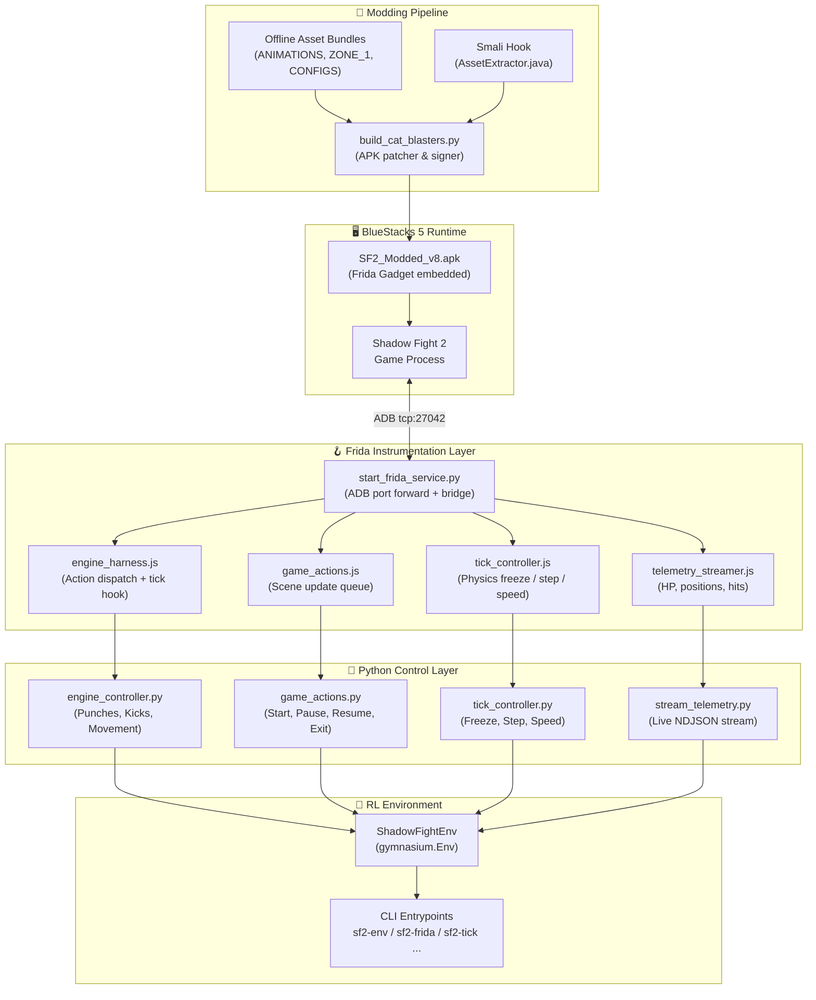

# 🥷 Shadow Fight 2 — Reinforcement Learning & Modding Environment

> A complete toolkit for reverse engineering, modding, and training autonomous RL agents on **Shadow Fight 2** (Unity IL2CPP Android game running in BlueStacks 5).

---

## 🗺️ Architecture Overview

This project transforms a black-box commercial mobile game into a standard **OpenAI Gymnasium** environment by combining three major pillars:



---

## ⚡ Quick Start (3 Steps)

### Prerequisites

| Requirement | Details |
|---|---|
| **BlueStacks 5** | Installed with `SF2_Modded_v8.apk` |
| **ADB enabled** | BlueStacks → Settings → Advanced → Android Debug Bridge = **ON** |
| **Python 3.12 + uv** | `uv venv .venv && uv pip install -e .` |
| **Java 11+** | Required for APK rebuild/signing pipeline only |
| **Frida port** | `& "C:\Program Files\BlueStacks_nxt\HD-Adb.exe" forward tcp:27042 tcp:27042` |

### Steps

```powershell
# 1. Install the latest modded APK into BlueStacks
.\bluestacks\scripts\install_apk.ps1 -Target v8
# Navigate to the Act 1 Tournament map in-game

# 2. Forward the Frida gadget port and start the bridge
sf2-frida

# 3. Launch the interactive RL REPL
sf2-env interactive
```

---

## 📦 APK Milestone Builds

> [!IMPORTANT]
> All APKs in `bluestacks/apks/` are **immutable milestones** and must never be overwritten. Always increment the version for new builds. **Use `SF2_Modded_v8.apk` for all RL work.**

| APK | Size | Description |
|---|---|---|
| `SF2_OG.apk` | 162.75 MB | 🔒 Untampered baseline — never modify |
| `SF2_Modded_v1.apk` | 333.23 MB | Protected milestone build |
| `SF2_Modded_v2.apk` | 333.23 MB | Act 1 Map cold boot |
| `SF2_Modded_v3.apk` | 333.20 MB | Act 1 Map + VIP Infinite Energy |
| `SF2_Modded_v4.apk` | 333.23 MB | Configurable N rounds per match |
| `SF2_Modded_v5.apk` | 333.23 MB | Dojo sparring scene restoration |
| `SF2_Modded_v6.apk` | 333.23 MB | Act 1 cold boot + Dojo menu |
| `SF2_Modded_v7.apk` | 342.91 MB | Embedded Frida Gadget milestone |
| `SF2_Modded_v8.apk` | 342.90 MB | ✅ **Current** — Unconditional Frida Gadget on every boot |
| `SF2_Modded_v9.apk` | — | Target for next modded build |

---

## 🐍 Python RL Loop Example

```python
import gymnasium as gym
from rl_env import ShadowFightEnv

env = ShadowFightEnv()
obs, info = env.reset()

for step in range(1000):
    # Sample a random action: [direction (0-8), button (0-2)]
    action = env.action_space.sample()
    obs, reward, terminated, truncated, info = env.step(action)

    print(
        f"Step {step:4d} | reward={reward:+.3f} | player_hp={info['player_hp']:.2f} | enemy_hp={info['enemy_hp']:.2f}"
    )

    if terminated or truncated:
        obs, info = env.reset()

env.close()
```

### Action & Observation Spaces

| Space | Type | Details |
|---|---|---|
| **Action** | `MultiDiscrete([9, 3])` | 9 movement directions × 3 button actions (punch / kick / none) |
| **Observation** | `Box` | Stacked 84×84 grayscale frames + scalar state (HP, distance) |
| **Reward** | Dense | Damage delta + head-hit bonus + critical bonus − time penalty |

---

## 🖥️ CLI Reference

### Service Management

```powershell
sf2-frida                    # Start Frida bridge + ADB port forward (one-shot)
sf2-frida --watch            # Continuous health monitor (auto-reconnect)
```

### RL Environment

```powershell
sf2-env interactive          # Drop into the interactive REPL console
sf2-env start                # Start a fight round
sf2-env step 10              # Advance 10 physics ticks
sf2-env state                # Dump full telemetry as JSON
sf2-env speed 5.0            # Set 5× simulation speed
sf2-env reset                # Soft-reset episode (restore HP, restart round)
```

### Low-Level Control

```powershell
sf2-actions start            # Native start fight (IL2CPP scene queue)
sf2-actions pause
sf2-actions resume
sf2-actions exit

sf2-tick freeze              # Freeze physics clock
sf2-tick step                # Advance one physics tick
sf2-tick unfreeze            # Resume real-time physics
sf2-tick speed 3.0           # 3× speed

sf2-telemetry --pretty       # Pretty-print live telemetry JSON
sf2-telemetry --pretty --live  # Streaming live telemetry (NDJSON)
```

### Engine Controller REPL

```powershell
# Interactive low-level native action controller
.venv\Scripts\python.exe scripts/engine_controller.py
```

---

## 📂 Scripts Reference

| Script | Purpose |
|---|---|
| [`scripts/start_frida_service.py`](scripts/start_frida_service.py) | Frida bridge & ADB port-forward manager |
| [`scripts/engine_controller.py`](scripts/engine_controller.py) | Native IL2CPP action controller — punches, kicks, movement, combos |
| [`scripts/game_actions.py`](scripts/game_actions.py) | In-engine combat flow controller — start, pause, resume, exit, set_rounds |
| [`scripts/tick_controller.py`](scripts/tick_controller.py) | Master timing controller — freeze, step, N× speed, auto-freeze |
| [`scripts/stream_telemetry.py`](scripts/stream_telemetry.py) | Live JSON telemetry streamer — HP, 3D positions, moves, hit events |
| [`scripts/frida/engine_harness.js`](scripts/frida/engine_harness.js) | Frida JS hook: action dispatch + physics tick interception |
| [`scripts/frida/game_actions.js`](scripts/frida/game_actions.js) | Frida JS hook: main-thread scene update queue |
| [`scripts/frida/telemetry_streamer.js`](scripts/frida/telemetry_streamer.js) | Frida JS hook: HP, Vector3 positions, moves & hit badges |
| [`scripts/frida/tick_controller.js`](scripts/frida/tick_controller.js) | Frida JS hook: physics tick freeze, speed & step |

---

## 🤖 RL Environment Package

| File | Purpose |
|---|---|
| [`rl_env/shadow_fight_env.py`](rl_env/shadow_fight_env.py) | `ShadowFightEnv` — high-level `gymnasium.Env` wrapping all subsystems |
| [`rl_env/__init__.py`](rl_env/__init__.py) | Package exports (`ShadowFightEnv`, `SF2Env`) |
| [`rl_env/__main__.py`](rl_env/__main__.py) | CLI entrypoint (`python -m rl_env`) |
| [`rl_env/test_env.py`](rl_env/test_env.py) | Verification test suite |
| [`pyproject.toml`](pyproject.toml) | PEP 517/621 package config & all CLI entrypoints |

---

## 📚 Documentation Index

| Document | Description |
|---|---|
| [`.agents/AGENTS.md`](.agents/AGENTS.md) | 📋 **Master rules, architecture, and full experiment log (64+ entries)** |
| [`modding/README.md`](modding/README.md) | 🔧 Modding pipeline hub & quick reference |
| [`bluestacks/README.md`](bluestacks/README.md) | 🖥️ BlueStacks setup & configuration guide |
| [`modding/docs/01_ARCHITECTURE_OVERVIEW.md`](modding/docs/01_ARCHITECTURE_OVERVIEW.md) | Unity IL2CPP game engine architecture |
| [`modding/docs/02_TEXTURES_AND_GRAPHICS.md`](modding/docs/02_TEXTURES_AND_GRAPHICS.md) | UnityPy texture extraction & injection |
| [`modding/docs/03_IL2CPP_AND_BINARY_PATCHING.md`](modding/docs/03_IL2CPP_AND_BINARY_PATCHING.md) | ARM64 IL2CPP reverse engineering & binary patching |
| [`modding/docs/04_SAVE_PROFILES_AND_PROGRESSION.md`](modding/docs/04_SAVE_PROFILES_AND_PROGRESSION.md) | Save XML provisioning & hash bypass |
| [`modding/docs/05_OFFLINE_BUNDLES_AND_CDN.md`](modding/docs/05_OFFLINE_BUNDLES_AND_CDN.md) | Offline DLC bundle embedding & CDN downloader |
| [`modding/docs/06_STARTUP_SMALI_HOOK.md`](modding/docs/06_STARTUP_SMALI_HOOK.md) | Smali `AssetExtractor` startup hook |
| [`modding/docs/07_BUILD_AND_SIGNING_PIPELINE.md`](modding/docs/07_BUILD_AND_SIGNING_PIPELINE.md) | APK build, zipalign, and v1/v2/v3 signing |
| [`modding/docs/08_ENGINE_CONTROLLER_AND_RL_HARNESS.md`](modding/docs/08_ENGINE_CONTROLLER_AND_RL_HARNESS.md) | Frida engine controller & RL harness internals |
| [`modding/docs/09_HEADLESS_AND_CONTAINERIZED_RUNTIMES.md`](modding/docs/09_HEADLESS_AND_CONTAINERIZED_RUNTIMES.md) | Headless & containerized emulator runtimes |
| [`modding/docs/10_ROSTER_AND_ARENAS_CATALOG.md`](modding/docs/10_ROSTER_AND_ARENAS_CATALOG.md) | Full fighter roster & arena catalog |

---

## 🗂️ Repository Layout

```text
Shadow Fight 2/
├── .agents/                    # Agent rules, architecture & skills
│   ├── AGENTS.md               # Master documentation & experiment log
│   └── skills/                 # Reusable modding & reversing skill packs
├── scripts/                    # Core RL & automation harness
│   ├── start_frida_service.py
│   ├── engine_controller.py
│   ├── game_actions.py
│   ├── tick_controller.py
│   ├── stream_telemetry.py
│   └── frida/                  # Standalone Frida JS hooks
│       ├── engine_harness.js
│       ├── game_actions.js
│       ├── telemetry_streamer.js
│       └── tick_controller.js
├── rl_env/                     # Gymnasium environment package
│   ├── shadow_fight_env.py
│   ├── test_env.py
│   ├── __init__.py
│   └── __main__.py
├── bluestacks/                 # BlueStacks runtime & APKs
│   ├── apks/                   # Immutable versioned APK builds
│   └── scripts/install_apk.ps1
├── modding/                    # Reverse engineering & build pipeline
│   ├── pipeline/               # Build scripts (patcher, signer, downloader)
│   ├── assets/                 # Textures, saves, smali hooks, bundles
│   ├── docs/                   # In-depth technical guides (01–10)
│   └── tools/                  # apktool, uber-apk-signer, Il2CppDumper
├── pyproject.toml              # Python package & CLI entrypoints
├── Makefile / make.bat         # Automation shortcuts
└── .venv/                      # Isolated Python 3.12 environment (uv)
```

---

## 🔭 Roadmap

- [ ] **Milestone 3** — Full `ShadowFightEnv` with DXcam frame capture integration
- [ ] **Milestone 4** — PPO/SAC training loop with stable-baselines3
- [ ] **Milestone 5** — Multi-opponent curriculum (Act 1 → Act 6 tournament fighters)
- [ ] **Milestone 6** — Headless / containerized BlueStacks training pipeline

---

> [!NOTE]
> See [`.agents/AGENTS.md`](.agents/AGENTS.md) for the full experiment log, agent rules of engagement, and deep-dive architecture documentation. All agents and contributors **must** read and follow those rules before making any changes to this repository.
