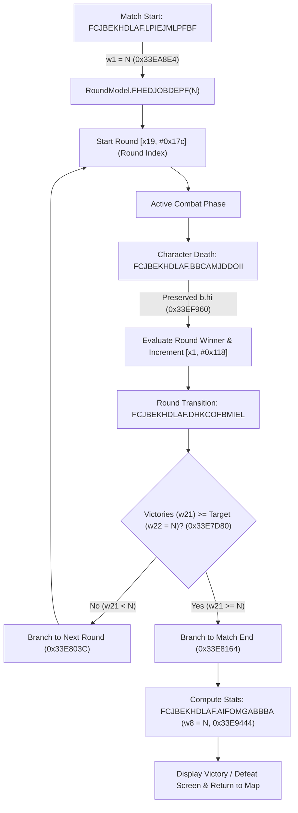

# Document 03: IL2CPP & ARM64 Binary Patching

This document provides a comprehensive breakdown of the native binary reverse engineering, method mapping, and assembly patching performed on `libil2cpp.so` to neutralize anti-cheat routines, save validators, missing pack checks, and unwanted UI popups.

---

## 1. How IL2CPP Works & How It Was Reverse Engineered

In Unity IL2CPP:
1. All C# code is translated to C++ and compiled Ahead-of-Time into ARM64 native assembly in `lib/arm64-v8a/libil2cpp.so`.
2. All class names, method signatures, field names, and string literals are stripped from the `.so` and stored in an encrypted/indexed table: `assets/bin/Data/Managed/Metadata/global-metadata.dat`.
3. We used **`Il2CppDumper`** ([`modding/tools/Il2CppDumper/`](file:///c:/Users/Ishan/Personal/Porfolio/Shadow%20Fight%202/modding/tools/Il2CppDumper/)) to correlate the string indices with the `.so` code addresses, generating:
   * **`dump.cs`** (28.6 MB, located in `modding/build_cache/il2cpp_dump/dump.cs`): Contains all decompiled C# classes, method signatures, RVAs, and file offsets.
   * **`stringliteral.json`**: Contains all hardcoded strings (e.g. `"dlgServiceDownloadDemand"`, `"HackTitle"`, `"users.xml"`) and the memory offsets referencing them.

---

## 2. ARM64 Assembly Mechanics (Cheat Sheet)

ARM64 instructions are fixed 4-byte words, encoded in **little-endian** byte order:

| Desired Logic | C# Equivalent | ARM64 Assembly | Hex String (Little-Endian) |
| :--- | :--- | :--- | :--- |
| **Return `true`** | `return true;` | `mov w0, #1`<br>`ret` | `20008052 c0035fd6` |
| **Return `false`** | `return false;` | `mov w0, #0`<br>`ret` | `00008052 c0035fd6` |
| **No-Op Function** | `return;` | `ret`<br>`nop` | `c0035fd6 1f2003d5` |
| **Direct Branch** | `goto offset;` | `b <relative_offset>` | e.g. `fea90114` |

---

## 3. Active Binary Patch Catalog

All active patches are defined in `so_patches` in [`modding/pipeline/build_cat_blasters.py`](file:///c:/Users/Ishan/Personal/Porfolio/Shadow%20Fight%202/modding/pipeline/build_cat_blasters.py#L188-L201):

### A. Save File & XML Hash Validation Bypasses
The game verifies that `users.xml` has not been tampered with by hashing its contents with a proprietary salt and comparing it against `users.xml.hash`. If the hash mismatches or cannot be validated, the game wipes the save or rejects it.

| File Offset | Obfuscated Class & Method | Original Function | Our Patch | What It Accomplishes |
| :--- | :--- | :--- | :--- | :--- |
| `0x3598568` | `CFJANHACGMG.AMELFFLEPNF` | `ValidateXmlHash(string)` | `mov w0, #1; ret` | Forces the primary XML validator to always report "valid" (`true`). |
| `0x3594984` | `CFJANHACGMG.AMELFFLEPNF` (Direct) | Secondary hash validator | `mov w0, #1; ret` | Bypasses direct internal hash check routine. |
| `0x35951B4` | `CFJANHACGMG.FNIHLBLMOBP` | Internal hash comparer | `mov w0, #1; ret` | Bypasses secondary signature verification. |
| `0x3595870` | `CFJANHACGMG.PBACHEOJBGG` | Backup hash checker | `mov w0, #1; ret` | Bypasses `users_backup.xml` verification. |
| `0x3595E1C` | `CFJANHACGMG.PKACMGFBIKK` | Deep file validator | `mov w0, #1; ret` | Bypasses checksum integrity check on XML nodes. |

### B. Anti-Cheat & "Data Corrupted" Panic Routines
Even if hash checks pass, an active background controller (`EOOEOHKLOFJ`) monitors runtime variables (currency deltas, equipment tiers, unearned perks). When triggered, it spawns the `"Your game data may be corrupted"` dialog (`HackTitle`) and forces the game to close.

| File Offset | Obfuscated Class & Method | Original Function | Our Patch | What It Accomplishes |
| :--- | :--- | :--- | :--- | :--- |
| `0x30C3344` | `EOOEOHKLOFJ.EOJDBAHODGK` | `CheckIntegrityPass()` | `mov w0, #1; ret` | Reports that the anti-cheat verification completed with zero infractions. |
| `0x30C1250` | `EOOEOHKLOFJ.MACGEGDGBOI` | `ShowHackDialogAndQuit()` | `ret; nop` | Neutralizes the crash/force-quit dialog creation completely. The function returns immediately without doing anything. |
| `0x30C11D8` | `EOOEOHKLOFJ.HBGCPAEJCJJ` | `GetHackCount()` | `mov w0, #0; ret` | Forces the internal hack detector to report `0` hacks detected. |

### C. Missing Content & Pack Demand Check Bypass
On boot and before starting fights, `AAPGCAPGBLG` checks if any story or event asset packs are missing.

| File Offset | Class & Method | Original Function | Our Patch | What It Accomplishes |
| :--- | :--- | :--- | :--- | :--- |
| `0x325BD24` | `AAPGCAPGBLG.MCFHOHANNDH` | `CheckPacksNeeded()` | `mov w0, #0; ret` | Returns `false` (zero packs needed). Even if an online pack check runs, the engine never triggers the `"LOADING REQUIRED!"` demand dialog. |

### D. Startup Dialogs & Modals Elimination
| File Offset | Class & Method | Original Function | Our Patch | What It Accomplishes |
| :--- | :--- | :--- | :--- | :--- |
| `0x34377F4` | `AGGMBMDDJIO.NKLGCNHLBAF` | `ShowGooglePlayWarning()` | `mov w1, #1; b 0x34a5ff4` | Silences the modal "Warning! Your game progress will be lost without Google Play Games". |
| `0x3437AFC` | `AGGMBMDDJIO.JFGBPBOCOIC` | `CheckGooglePlayLogin()` | `mov w0, #0; ret` | Disables the automatic Google Play Games login prompt. |
| `0x32D9388` | `LJBDMDHNKFM.JFGBPBOCOIC` | `ShowGDPRDialog()` | `mov w0, #0; ret` | Permanently suppresses the European GDPR Privacy Policy / Terms modal on first boot. |

### E. Arbitrary Round Control & Match Victory Threshold Parameterization
Standard Shadow Fight 2 matches operate on a hardcoded "first to 2 round victories" rule (`best-of-3`), while Boss encounters default to 3 round victories (`best-of-5`). For reinforcement learning training loops or custom sparring benchmarks, we reverse-engineered the core combat lifecycle in `FightManager` (`FCJBEKHDLAF`) to allow configuring any arbitrary target number of rounds $N$ per match.



#### Detailed Patch Table & Register Mappings

| File Offset | Class & Method | Original Instruction | Patched Instruction | What It Accomplishes |
| :--- | :--- | :--- | :--- | :--- |
| `0x33E7D80` | `FCJBEKHDLAF.DHKCOFBMIEL` | `ldr w22, [x10, #0x1c]` | `mov w22, #N` | Overrides the victory comparator register `w22` during round transition checks. The game continuously loops through rounds until either combatant reaches $N$ victories (`w21 >= w22`), preventing premature match completion or unwanted extra rounds. |
| `0x33E9444` | `FCJBEKHDLAF.AIFOMGABBBA` | `mov w8, #2` | `mov w8, #N` | Synchronizes the match statistics victory threshold with $N$ so post-match rating and reward calculations evaluate properly. |
| `0x33EA8E4` | `FCJBEKHDLAF.LPIEJMLPFBF` | `ldr w1, [x8, #0x1c]` | `mov w1, #N` | Overrides the parameter passed to `RoundModel.FHEDJOBDEPF(w1)`, ensuring the rules engine and UI round indicators initialize with target $N$. |
| `0x33EF960` | `FCJBEKHDLAF.BBCAMJDDOII` | `b.hi 0x33ef9a8` | `b.hi 0x33ef9a8` (preserved) | Ensures standard round evaluation so that matches continue across rounds 1, 2, ..., $N$ and only trigger the victory sequence when the target score is attained. |

#### Internal Struct & Field Mapping
* **`FCJBEKHDLAF` (`FightManager`)**: Universal match orchestrator instance.
  * `[x19, #0x17c]` (`CLFDJLLDNGD`): Current round index integer (0-indexed).
  * `[x1, #0x118]`: Current combatant round victory tally.
* **`JIMKCICMMIL` (Fight Settings / Rules Model)**:
  * `[x10, #0x1c]`: Original hardcoded round target (2 for tournament, 3 for boss). Replaced at runtime by `mov w22, #N`.
* **`OJHODFIGFMA` (`RoundModel`)**:
  * Initialized via `FHEDJOBDEPF(int32 target_rounds)` with `w1 = N`.

#### Dynamic Instruction Generation
In [`modding/pipeline/build_cat_blasters.py`](file:///c:/Users/Ishan/Personal/Porfolio/Shadow%20Fight%202/modding/pipeline/build_cat_blasters.py#L30-L37), arbitrary round counts are encoded dynamically using ARM64 32-bit `movz` encoding:
$$\text{Opcode}(\text{rd}, N) = \text{0x52800000} \;\vert\; ((N \ \&\ \text{0xFFFF}) \ll 5) \;\vert\; (\text{rd} \ \&\ \text{0x1F})$$

Developers can modify `ROUNDS_TO_WIN = N` in the script or pass `--rounds <N>` to compile APKs configured for single-round deathmatches ($N=1$), standard matches ($N=2$), or marathon bouts ($N=5$).

#### Verification & Live Combat Confirmation
* **Build Target**: `SF2_Modded_v4.apk` (`333.23 MB`).
* **Encounter**: Act 1 Lynx encounter against bodyguard **Brick** on Insane difficulty (Rooftops stage).
* **Live Test Results**: User verified live in BlueStacks:
  * Match successfully ran across all rounds.
  * When either the player or opponent won 5 rounds, the match ended cleanly.
  * Verified full keyboard controls (`WASD`, `J`, `K`), virtual joystick responsiveness, and seamless round transitions.

---

## 4. "Changing What Changes What" (Modding Practical Guide)

### Want to freeze the match timer at 99.0 for infinite sparring?
1. Open `dump.cs` and search for `RoundTimer` or `BattleTimer`:
   * Look for `public float GetTimeLeft()` or `public void UpdateTimer(float dt)`.
2. Note the file offset of `UpdateTimer`.
3. Patch the function with `ret; nop` (`c0035fd6 1f2003d5`). The timer will never tick down.

### Want to create God Mode (Player Never Takes Damage)?
1. Search `dump.cs` for `DamageReceiver` or `CharacterHealth.ApplyDamage(float damage)`:
   * Look for method parameters taking damage: `public void TakeDamage(float damage, ...)`.
2. Check if the receiver is the player:
   * Patch `TakeDamage` to check if `this.IsPlayer` is true, or patch the damage calculation to multiply player incoming damage by `0.0`.

### What happens if the game updates to a new version (e.g. 2.47.0)?
* The exact hex file offsets (`0x3598568`, etc.) **will change** because newly added functions shift code addresses.
* To adapt:
  1. Extract `libil2cpp.so` and `global-metadata.dat` from the new APK.
  2. Run `Il2CppDumper.exe` to generate a new `dump.cs`.
  3. Search `dump.cs` for the method signatures (e.g. `bool MCFHOHANNDH()`, `bool AMELFFLEPNF()`, `ShowGDPR`).
  4. Copy the new file offsets from `dump.cs` into `so_patches` in `build_cat_blasters.py`.

---

## 5. Runtime Memory Patching via Frida (vs. Static APK Patching)

There are two fundamentally different ways to modify IL2CPP instruction bytes. Understanding which approach to use — and why the addresses differ between them — is critical.

---

### A. The Two Patching Approaches

| | Static (APK Build-Time) | Runtime (Frida / Live Session) |
|---|---|---|
| **How** | `build_cat_blasters.py` writes patch bytes directly into the `.so` file inside the APK, then rebuilds and re-signs | `Memory.patchCode()` via the embedded Frida Gadget modifies the running process's memory pages |
| **Persistence** | Permanent — baked into the APK until the app is reinstalled | Ephemeral — lives only for the duration of the current process session |
| **APK rebuild needed?** | ✅ Yes — full `apktool` decode → patch → rebuild → sign cycle | ❌ No — zero APK changes; inject JavaScript at runtime |
| **Address space used** | Raw **ELF file offsets** (byte position within the `.so` file on disk) | **Virtual memory addresses** (position in the process's mapped address space) |

---

### B. The ELF Load Bias Problem

> [!IMPORTANT]
> This is the most critical subtlety when moving from static patching to Frida runtime patching: **file offsets and virtual memory addresses are NOT the same**.

When Android loads `libil2cpp.so`, the dynamic linker maps each ELF `PT_LOAD` segment into the process's virtual address space. The executable segment is not necessarily mapped at the same byte offset it occupies within the file — there is an alignment-induced delta called the **load bias**.

For `libil2cpp.so` in SF2 v2.46.0:

| ELF Segment Field | Value |
|---|---|
| `p_offset` (position within the file) | `0x18B299C` |
| `p_vaddr` (virtual address mapped to) | `0x18B699C` |
| **Load bias** = `p_vaddr − p_offset` | **`0x4000`** |

**The rule**:

$$\text{virtual\_RVA} = \text{file\_offset\_RVA} + \texttt{0x4000}$$

Any address copied out of `build_cat_blasters.py` (which uses file offsets) must have `0x4000` added before it can be used with `Memory.patchCode()`.

---

### C. How the Base Address Is Computed in JavaScript

Frida enumerates the process memory ranges to find where `libil2cpp.so` was loaded. However, `range.base` points into the middle of the library's mapping — it is not the start of the segment. The base is back-calculated so that `base.add(file_offset)` resolves correctly:

```javascript
// Find the libil2cpp.so mapping
var ranges = Process.enumerateRangesSync({ protection: 'r-x', coalesce: false });
var il2cppBase;
for (var i = 0; i < ranges.length; i++) {
    if (ranges[i].file && ranges[i].file.path.indexOf('libil2cpp.so') !== -1) {
        // Subtract the known segment start RVA to get the library base anchor
        il2cppBase = ranges[i].base.sub(0x18b6000);
        break;
    }
}

// To reach an instruction at a given file offset, use:
//   il2cppBase.add(file_offset)          → correct for static patch offsets
//   il2cppBase.add(file_offset + 0x4000) → correct for Frida virtual RVAs
```

> [!NOTE]
> The `0x18b6000` subtracted here is derived from the known `p_vaddr` of the segment (`0x18B699C` rounded down to the page boundary). This anchors `il2cppBase` such that adding any file offset directly yields the correct virtual address for that instruction.

---

### D. Corrected Round Control Address Table

The three round control sites require a `+0x4000` adjustment when targeting them from Frida:

| File Offset (APK build script) | Virtual RVA (Frida runtime) | Delta | Reg | Instruction |
|---|---|---|---|---|
| `0x33E7D80` | `0x33EBD80` | +`0x4000` | `w22` | `mov w22, #N` — victory comparator (`DHKCOFBMIEL`) |
| `0x33E9444` | `0x33ED444` | +`0x4000` | `w8`  | `mov w8, #N` — stats threshold (`AIFOMGABBBA`) |
| `0x33EA8E4` | `0x33EE8E4` | +`0x4000` | `w1`  | `mov w1, #N` — `RoundModel` initializer (`LPIEJMLPFBF`) |

---

### E. `Memory.patchCode()` vs. `Memory.protect()` + `writeU32()`

Two patterns exist for writing to executable memory in Frida. Always prefer `Memory.patchCode()`:

| | `Memory.protect()` + `addr.writeU32()` | `Memory.patchCode()` |
|---|---|---|
| **SELinux on code pages** | ⚠️ Can be **silently blocked** — Android's SELinux policy often denies `PROT_WRITE` on `r-x` pages; the write may be a no-op with no error thrown | ✅ Frida's dedicated API handles page remapping internally, bypassing SELinux restrictions |
| **Instruction cache** | ❌ Manual — you must call cache-flush primitives yourself to avoid stale icache entries | ✅ Automatically flushes the CPU instruction cache after patching |
| **Use case** | Fine for data pages (`rw-`) | **Always use for patching IL2CPP instructions** |

---

### F. Full JavaScript Example — Runtime Round Patching

```javascript
/**
 * arm64Movz — encode an ARM64 MOVZ Wd, #imm instruction.
 * @param {number} reg  - destination register index (0–31)
 * @param {number} imm  - immediate value (0–65535)
 * @returns {number}    - 32-bit little-endian instruction word
 */
function arm64Movz(reg, imm) {
    return (0x52800000 | ((imm & 0xFFFF) << 5) | (reg & 0x1F)) >>> 0;
}

/**
 * patchRounds — patch all three round-control sites to N rounds.
 * @param {number} n - number of rounds required to win a match
 */
function patchRounds(n) {
    var patches = [
        { rva: 0x33EBD80, reg: 22 },  // DHKCOFBMIEL — victory comparator
        { rva: 0x33ED444, reg: 8  },  // AIFOMGABBBA — stats threshold
        { rva: 0x33EE8E4, reg: 1  },  // LPIEJMLPFBF — RoundModel init
    ];

    patches.forEach(function(p) {
        (function(addr, instr) {
            Memory.patchCode(addr, 4, function(code) {
                code.writeU32(instr);
            });
            console.log('[patchRounds] ' + addr + ' <- 0x' + instr.toString(16));
        })(il2cppBase.add(p.rva), arm64Movz(p.reg, n));
    });
}

// Example: configure 2-round matches
patchRounds(2);
```

---

### G. Verifying the Patch Live

After calling `patchRounds(N)`, confirm the instructions were written correctly using Frida's built-in disassembler:

```javascript
// Inspect the victory comparator site after patching
var ins = Instruction.parse(il2cppBase.add(0x33EBD80));
console.log(ins.mnemonic + ' ' + ins.opStr);
// Expected output after patchRounds(2): "mov w22, #2"

// Inspect the RoundModel initializer site
var ins2 = Instruction.parse(il2cppBase.add(0x33EE8E4));
console.log(ins2.mnemonic + ' ' + ins2.opStr);
// Expected output after patchRounds(2): "mov w1, #2"
```

> [!TIP]
> If `Instruction.parse` reports the old instruction after patching, the write was silently blocked (likely SELinux on a `protect+write` attempt). Switch to `Memory.patchCode()` if you haven't already, and confirm Frida Gadget is loaded from a writable path rather than a read-only APK asset.
