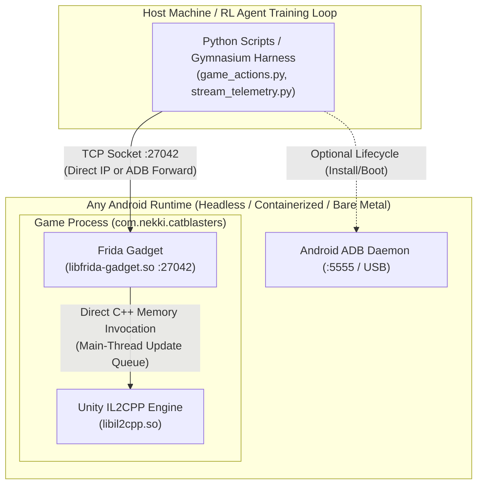

# Headless, Containerized & Emulator-Agnostic SF2 Environment Guide

This document explains how the Shadow Fight 2 RL harness operates in a **100% emulator-agnostic and headless architecture**, eliminating all dependencies on BlueStacks or proprietary GUI emulators.

---

## 1. Architectural Principles



### Why the System is Emulator-Agnostic
1. **Zero OS Touch Simulation**: No `adb shell input tap` or window coordinates are used for combat flow. Pausing, unpausing, exiting fights, and character actions are dispatched via direct C++ memory invocations inside `libil2cpp.so`.
2. **Direct Socket RPC**: Frida Gadget is compiled directly into the APK (`lib/arm64-v8a/libfrida-gadget.so`) and loads on boot via `AssetExtractor.smali`. It listens on TCP port `27042`. Any environment that can route a TCP packet to port 27042 can fully observe and control the game.
3. **Headless Execution**: The game runs without requiring an active graphical desktop window. It can render via software rasterizers (SwiftShader / Mesa llvmpipe) or headless virtual framebuffers (`Xvfb`).

---

## 2. Supported Android Runtimes

### A. Docker + ReDroid (Recommended for Cloud / Linux Headless Clusters)
[ReDroid (Remote Android in Docker)](https://github.com/remote-android/redroid-doc) is a GPU/CPU-accelerated Android container runtime running directly on Linux kernels.

#### 1. Launch ReDroid Container:
```bash
docker run -d --rm \
    --privileged \
    --name sf2-headless \
    -p 5555:5555 \
    -p 27042:27042 \
    -v ~/data:/data \
    redroid/redroid:11.0.0-latest \
    androidboot.redroid_width=1920 \
    androidboot.redroid_height=1080 \
    androidboot.redroid_dpi=320 \
    androidboot.redroid_gpu_mode=guest
```

#### 2. Install & Launch Game:
```bash
adb connect 127.0.0.1:5555
adb -s 127.0.0.1:5555 install -r bluestacks/apks/SF2_Modded_v8.apk
adb -s 127.0.0.1:5555 shell monkey -p com.nekki.catblasters -c android.intent.category.LAUNCHER 1
```

#### 3. Connect RL Harness Directly:
```bash
# Connect directly to exposed container port without ADB forwarding:
export FRIDA_DIRECT=1
export FRIDA_HOST=127.0.0.1
export FRIDA_PORT=27042

python scripts/game_actions.py status
```

---

### B. Standard Android Studio AVD (Headless Mode)
Works on any Linux, macOS, or Windows developer workstation with the Android SDK.

```bash
# Start an ARM64 AVD headlessly with no GUI or audio
emulator -avd SF2_Pixel_ARM64 -no-window -no-audio -no-boot-anim -gpu swiftshader_indirect &

# Auto-discovered by scripts via standard adb:
python scripts/game_actions.py status
```

---

### C. Waydroid / Anbox (Native Linux Desktop / Container)
Runs Android in an LXC container sharing the Linux kernel:
```bash
waydroid session start
waydroid app launch com.nekki.catblasters

# Connect via ADB:
adb connect 192.168.240.112:5555
python scripts/game_actions.py status
```

---

### D. BlueStacks 5 (Optional Windows Local Dev)
BlueStacks 5 remains supported for local interactive development on Windows, but is strictly optional.

---

## 3. Environment Variables Reference

All Python scripts (`common.py`, `game_actions.py`, `engine_controller.py`, `stream_telemetry.py`) automatically honor the following environment variables:

| Variable | Description | Default | Example |
| :--- | :--- | :--- | :--- |
| `ANDROID_SERIAL` | Explicit target device or container serial | Auto-detected from `adb devices` | `127.0.0.1:5555` or `emulator-5554` |
| `ADB_PATH` / `ADB_BIN` | Custom path to the ADB binary | System `PATH` (`shutil.which`) | `/usr/bin/adb` or `C:\platform-tools\adb.exe` |
| `ADB_CONNECT` | Fallback connection string when no devices are online | `127.0.0.1:5555` | `192.168.1.50:5555` |
| `FRIDA_HOST` | Host address of Frida Gadget | `127.0.0.1` | `172.17.0.2` (Docker IP) |
| `FRIDA_PORT` | Port of Frida Gadget | `27042` | `27042` |
| `FRIDA_DIRECT` | If `1`, skips ADB port forwarding and connects directly over TCP | `0` (uses ADB forward) | `1` |

---

## 4. Cross-Platform Verification

All scripts are written in pure Python 3 using:
- `shutil.which("adb")` instead of hardcoded Windows paths.
- Cross-platform path separators (`os.path.join`).
- Dynamic host/port bindings.
- Graceful socket error handling without unhandled exceptions.
