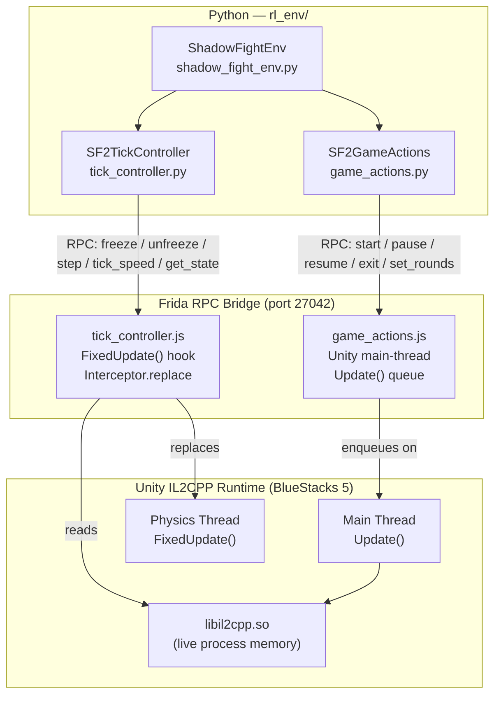

# `rl_env` — Shadow Fight 2 Reinforcement Learning Environment


A high-level **OpenAI Gymnasium-compatible** Python interface for training Reinforcement Learning agents against *Shadow Fight 2 v2.46.0*, running on BlueStacks 5. Wraps Frida-based IL2CPP hooks to expose deterministic, **tick-level** game control over physics, combat actions, and live telemetry — without any screen capture or image processing.

---

## Table of Contents

1. [Prerequisites](#prerequisites)
2. [Quick Start](#quick-start)
3. [Architecture](#architecture)
4. [API Reference](#api-reference)
   - [Constructor](#constructor)
   - [Methods](#methods)
   - [Action Map](#action-map)
5. [State Dictionary Schema](#state-dictionary-schema)
6. [Interactive REPL](#interactive-repl)
7. [CLI Reference](#cli-reference)
8. [Example: Simple Step Loop](#example-simple-step-loop)
9. [Tick-Based Timing & Speed Invariance](#tick-based-timing--speed-invariance)
10. [`set_rounds()` & ELF Load Bias](#set_rounds--elf-load-bias)
11. [Running Tests](#running-tests)
12. [Package Layout](#package-layout)

---

## Prerequisites

Before using this package, ensure the following are in place:

| # | Requirement | Details |
|---|-------------|---------|
| 1 | **SF2_Modded_v8.apk** installed and **running** in BlueStacks 5 | Must be the Frida Gadget build — no other APK version embeds the Gadget |
| 2 | **Frida port forwarded** over ADB | See the port-forward command below |
| 3 | **Package installed** into `.venv` | `uv pip install -e .` from the repo root |
| 4 | **Java 11+** on `PATH` | Required only if rebuilding APKs, not for runtime use |

### Port Forward Command

```powershell
# Run once after BlueStacks boots (or use sf2-frida to manage it automatically)
& "C:\Program Files\BlueStacks_nxt\HD-Adb.exe" forward tcp:27042 tcp:27042
```

Or use the managed Frida service:

```powershell
sf2-frida          # Start + keep-alive Frida connection manager
# -- or --
python scripts/start_frida_service.py --watch
```

---

## Quick Start

> [!IMPORTANT]
> BlueStacks must already be running with **SF2_Modded_v8.apk** open and at the fight screen before issuing any commands.

**Step 1 — Activate the virtual environment:**

```powershell
.venv\Scripts\Activate.ps1
```

**Step 2 — Forward the Frida port:**

```powershell
& "C:\Program Files\BlueStacks_nxt\HD-Adb.exe" forward tcp:27042 tcp:27042
```

**Step 3 — Start a fight and step through it:**

```python
from rl_env import ShadowFightEnv

env = ShadowFightEnv()
state = env.start()          # freeze at tick 1, returns initial state
print(state)

for _ in range(20):
    state = env.step(action='dp')   # forward-dash + punch, advance 1 tick

env.close()
```

---

## Architecture

The `ShadowFightEnv` class is a thin Python orchestrator over **two Frida JavaScript hooks** that are injected at runtime into the running SF2 process via the embedded Frida Gadget.



### Key Design Decisions

- **`SF2GameActions`** (`game_actions.js`) — handles all scene-level transitions (start fight, pause, resume, surrender, set round count). These must run on the **Unity main thread** `Update()` loop to be safe for IL2CPP managed objects.
- **`SF2TickController`** (`tick_controller.js`) — hooks `FixedUpdate()` via `Interceptor.replace`, giving deterministic control over the physics tick. Exposes freeze, step, speed multiplier, and the live telemetry read.
- **Auto-freeze on start**: `start()` arms a one-shot auto-freeze trigger. The moment the round-start fires (timer countdown ends), the hook freezes `FixedUpdate()` and returns telemetry. This trigger is **disarmed immediately** after the first fire so that subsequent rounds in the same fight proceed without re-freezing.

---

## API Reference

### Constructor

```python
ShadowFightEnv(host='127.0.0.1', port=27042)
```

| Parameter | Type | Default | Description |
|-----------|------|---------|-------------|
| `host` | `str` | `'127.0.0.1'` | Frida server hostname. Overridden by `FRIDA_HOST` env var. |
| `port` | `int` | `27042` | Frida server port. Overridden by `FRIDA_PORT` env var. |

> [!TIP]
> Set `FRIDA_HOST` and `FRIDA_PORT` environment variables to avoid hardcoding connection details in training scripts.

---

### Methods

| Method | Returns | Description |
|--------|---------|-------------|
| `connect()` | `bool` | Explicitly attach to Frida. Auto-called on first use of any method. |
| `start(timeout=20.0)` | `Dict` | Queue a fight start, arm auto-freeze, advance 1 tick, return initial state. |
| `step(steps=None, action=None)` | `Dict` | Advance `steps` ticks (default `1`). Optionally inject an `action` before stepping. Returns state after the final tick. |
| `freeze()` | `bool` | Freeze `FixedUpdate()` — game physics halts completely. |
| `unfreeze()` | `bool` | Resume continuous `FixedUpdate()` execution. |
| `tick_speed(speed=None)` | `float` | Set Unity `timeScale` multiplier. Pass `None` to query current speed. |
| `pause()` | `bool` | Issue a native IL2CPP in-engine pause (the game's own pause menu state). |
| `resume()` | `bool` | Issue a native IL2CPP in-engine unpause. |
| `exit()` | `bool` | Surrender the current fight and return to the Act map. |
| `set_rounds(n)` | `int` | Patch rounds-to-win to `n` (1–99) in live process memory. No APK rebuild needed. |
| `get_rounds()` | `Optional[int]` | Return the currently patched round count, or `None` if not set. |
| `get_state()` | `Dict` | Read and return the current telemetry frame without advancing any ticks. |
| `close()` | `None` | Detach from Frida, restore `timeScale` to `1.0x`. Call in `finally` blocks. |
| `state` *(property)* | `Dict` | The last state dict returned by `start()`, `step()`, or `get_state()`. |

---

### Action Map

Pass any of the following string keys to `step(action=...)` or the REPL. The hook translates them into joystick + button events injected into the IL2CPP `InputReceiver`.

#### Movement

| Key | Action |
|-----|--------|
| `'w'` | Jump |
| `'s'` | Duck / crouch |
| `'a'` | Step backward |
| `'d'` | Step forward |

#### Compound Movement

| Key | Action |
|-----|--------|
| `'wa'` | Jump + back |
| `'wd'` | Jump + forward |
| `'sa'` | Duck + back |
| `'sd'` | Duck + forward |

#### Dashes

| Key | Action |
|-----|--------|
| `'aa'` | Dash backward |
| `'dd'` | Dash forward |

#### Basic Attacks

| Key | Action |
|-----|--------|
| `'p'` | Punch |
| `'k'` | Kick |
| `'pp'` | Double punch |
| `'kk'` | Double kick |

#### Directional Attacks

| Key | Action |
|-----|--------|
| `'wp'` | Jump punch |
| `'sp'` | Crouch punch |
| `'ap'` | Back punch |
| `'dp'` | Forward punch |
| `'wk'` | Jump kick |
| `'sk'` | Crouch kick |
| `'ak'` | Back kick |
| `'dk'` | Forward kick |

#### Combos & Weapon Specials

| Key | Action |
|-----|--------|
| `'dpp'` | Forward double punch (Super Slash with Knives) |
| `'app'` | Back double punch |
| `'dkk'` | Forward double kick |
| `'akk'` | Back double kick |

---

## State Dictionary Schema

Every method that returns a `Dict` (and the `state` property) yields a **TELEMETRY_FRAME** with the following structure:

```json
{
  "type":       "TELEMETRY_FRAME",
  "tick":       1042,
  "time_left":  87.3,
  "frozen":     true,
  "speed":      1.0,
  "in_fight":   true,
  "player": {
    "hp":           0.84,
    "x":            -1.23,
    "y":            0.0,
    "z":            0.0,
    "facing_left":  false,
    "action":       "KnivesStartStanceIdle"
  },
  "opponent": {
    "hp":           1.0,
    "x":            1.45,
    "y":            0.0,
    "z":            0.0,
    "facing_left":  true,
    "action":       "ForwardRoll"
  },
  "distance":   268.5,
  "hits": {
    "head_hit":     false,
    "critical_hit": false,
    "shock":        false,
    "blocked_hit":  false
  },
  "damage_delta": {
    "player":   0.0,
    "opponent": 0.0
  }
}
```

### Field Reference

| Field | Type | Description |
|-------|------|-------------|
| `type` | `str` | Always `"TELEMETRY_FRAME"`. |
| `tick` | `int` | Monotonically increasing physics tick counter since round start. |
| `time_left` | `float` | Seconds remaining on the round timer (frozen if `frozen=true`). |
| `frozen` | `bool` | Whether `FixedUpdate()` is currently halted. |
| `speed` | `float` | Current Unity `timeScale` multiplier (`1.0` = normal). |
| `in_fight` | `bool` | `true` while a round is active; `false` during transitions or menus. |
| `player.hp` | `float` | Player HP normalised to `[0.0, 1.0]`. |
| `player.x/y/z` | `float` | Player world-space position (Unity units). SF2 is 2.5D; `y` and `z` are typically `0.0`. |
| `player.facing_left` | `bool` | Direction the player character sprite is facing. |
| `player.action` | `str` | IL2CPP animation state name of the player's current action. |
| `opponent.hp` | `float` | Opponent HP normalised to `[0.0, 1.0]`. |
| `opponent.x/y/z` | `float` | Opponent world-space position. |
| `opponent.facing_left` | `bool` | Direction the opponent character sprite is facing. |
| `opponent.action` | `str` | IL2CPP animation state name of the opponent's current action. |
| `distance` | `float` | Raw pixel distance between player and opponent on the X axis. |
| `hits.head_hit` | `bool` | A head hit landed *this tick*. |
| `hits.critical_hit` | `bool` | A critical hit landed *this tick*. |
| `hits.shock` | `bool` | A shock/stun effect applied *this tick*. |
| `hits.blocked_hit` | `bool` | A hit was blocked *this tick*. |
| `damage_delta.player` | `float` | HP lost by the **player** since the previous tick. |
| `damage_delta.opponent` | `float` | HP lost by the **opponent** since the previous tick. |

> [!NOTE]
> `damage_delta` values accumulate between `step()` calls only when `steps > 1`. On a single-tick step they reflect damage from that exact tick.

---

## Interactive REPL

Launch an interactive REPL session for manual exploration and debugging:

```powershell
sf2-env interactive
# -- or --
python -m rl_env
```

### REPL Command Reference

| Command | Description |
|---------|-------------|
| `start` | Start fight, arm auto-freeze, step 1 tick, print state. |
| `step <N> [action]` | Step `N` ticks; optionally inject `action` first. |
| `<N>` | Shorthand for `step <N>`. E.g. `10` steps 10 ticks. |
| `f` / `freeze` | Freeze physics — `FixedUpdate()` halts. |
| `u` / `unfreeze` | Resume continuous physics. |
| `speed <N>` | Set simulation speed multiplier (e.g. `speed 5`). |
| `pause` | Native IL2CPP in-engine pause. |
| `resume` | Native IL2CPP in-engine unpause. |
| `exit` | Surrender fight and return to Act map. |
| `rounds <N>` | Patch rounds-to-win to `N` at runtime. |
| `rounds` | Print currently patched round count. |
| `state` / `status` | Dump full state JSON to stdout. |
| *Action codes* | Any key from the Action Map (e.g. `p`, `dpp`, `wk`, `dd`). Executes the action and steps 1 tick. |
| `q` / `quit` | Exit the REPL and detach from Frida. |

**Example REPL session:**

```
sf2> start
{'tick': 1, 'frozen': True, 'player': {'hp': 1.0, ...}, ...}
sf2> speed 3
3.0
sf2> 50
{'tick': 51, ...}
sf2> dpp
{'tick': 52, 'opponent': {'hp': 0.88, ...}, ...}
sf2> state
{full JSON...}
sf2> quit
```

---

## CLI Reference

All CLI tools are available after activating `.venv` and installing the package (`uv pip install -e .`).

### `sf2-env` — Main RL Environment CLI

```powershell
sf2-env <command> [args]
```

| Command | Example | Description |
|---------|---------|-------------|
| `start` | `sf2-env start` | Start fight and print initial state. |
| `step <N>` | `sf2-env step 10` | Advance `N` ticks and print state. |
| `step <N> <action>` | `sf2-env step 6 dpp` | Advance `N` ticks with action. |
| `state` | `sf2-env state` | Query and print current state without advancing. |
| `freeze` | `sf2-env freeze` | Freeze physics. |
| `unfreeze` | `sf2-env unfreeze` | Resume physics. |
| `speed <N>` | `sf2-env speed 5.0` | Set simulation speed. |
| `pause` | `sf2-env pause` | Native in-engine pause. |
| `resume` | `sf2-env resume` | Native in-engine unpause. |
| `exit` | `sf2-env exit` | Surrender fight and return to map. |
| `rounds <N>` | `sf2-env rounds 1` | Patch rounds-to-win at runtime. |
| `interactive` | `sf2-env interactive` | Launch the interactive REPL. |

### Other CLI Entrypoints

| Command | Script | Description |
|---------|--------|-------------|
| `sf2-frida` | `scripts/start_frida_service.py` | Frida service manager — forwards ADB port and keeps connection alive. |
| `sf2-actions` | `scripts/game_actions.py` | Low-level game actions CLI (start, pause, resume, exit). |
| `sf2-tick` | `scripts/tick_controller.py` | Low-level tick controller CLI. |
| `sf2-telemetry` | `scripts/stream_telemetry.py` | Stream live NDJSON telemetry frames to stdout. |

---

## Example: Simple Step Loop

```python
from rl_env import ShadowFightEnv
import json

env = ShadowFightEnv()

try:
    # Boot into a 1-round fight
    env.set_rounds(1)
    state = env.start()
    print(f"Fight started at tick {state['tick']}")

    done = False
    total_damage = 0.0

    while not done:
        # Choose an action (replace with your policy)
        action = 'dp'  # forward punch

        # Advance 1 physics tick
        state = env.step(steps=1, action=action)

        # Accumulate reward signal
        total_damage += state['damage_delta']['opponent']

        # Check terminal condition
        player_hp   = state['player']['hp']
        opponent_hp = state['opponent']['hp']
        in_fight    = state['in_fight']

        if player_hp <= 0 or opponent_hp <= 0 or not in_fight:
            done = True

        print(f"Tick {state['tick']:5d} | P:{player_hp:.2f} vs O:{opponent_hp:.2f}"
              f" | dmg Δ {state['damage_delta']['opponent']:.3f}")

    print(f"\nEpisode complete. Total damage dealt: {total_damage:.4f}")

finally:
    env.close()
```

---

## Tick-Based Timing & Speed Invariance

> [!IMPORTANT]
> All timing in this environment is expressed in **physics ticks**, not wall-clock milliseconds. This is a deliberate design choice.

Shadow Fight 2 runs its physics simulation in Unity's `FixedUpdate()` loop, which advances one tick per call regardless of `timeScale`. By hooking `FixedUpdate()` directly:

- **`freeze()`** halts the loop entirely — time truly stops.
- **`step(N)`** advances exactly `N` ticks, then freezes again.
- **`tick_speed(N)`** adjusts Unity's `timeScale`, which controls how *fast* ticks are consumed in wall time — but does **not** change the number of ticks or their physics content.

This means any policy trained with `tick_speed(1.0)` behaves identically at `tick_speed(10.0)`. You can run training at 10× real-time without any observation or action semantics changing. Reward signals based on `damage_delta` and HP are computed from game-internal HP values, so they are also fully speed-invariant.

```
timeScale = 1.0  →  ~50 ticks/sec  (real-time)
timeScale = 5.0  →  ~250 ticks/sec (5× faster wall clock, same physics)
timeScale = 0.1  →  ~5 ticks/sec   (slow-motion for debugging)
```

---

## `set_rounds()` & ELF Load Bias

`set_rounds(n)` patches the rounds-to-win value **in live process memory** — no APK rebuild or reinstall is required. This is how it works:

1. **IL2CPP Dump** (`Il2CppDumper`) is used offline to locate the 3 ARM64 instructions that write the hardcoded round count into the `FightManager` initializer.
2. The **file offset** of each instruction is recorded from the `libil2cpp.so` binary.
3. At runtime, Frida resolves the **live virtual address** by applying the **ELF load bias**:
   ```
   virtual_address = file_offset + 0x4000
   ```
   The `0x4000` figure is the standard ELF segment load bias for `libil2cpp.so` in this build. It is added because the OS maps the ELF's first loadable segment starting at `0x4000` rather than `0x0`.
4. Frida's `Memory.patchCode()` rewrites the 3 instructions with an `MOV W0, #n; ... RET` sequence.

> [!NOTE]
> If the APK is rebuilt or the game updates, the file offsets will shift. Re-run `Il2CppDumper` and update the offsets in `tick_controller.js` accordingly. The load bias of `0x4000` is structural to this ELF and is unlikely to change between builds.

> [!CAUTION]
> `set_rounds()` patches live executable memory. Always call it **before** `start()` — patching mid-fight may result in undefined fight state. The patch persists for the entire Frida session and resets when the game process restarts.

---

## Running Tests

```powershell
# Activate the venv first
.venv\Scripts\Activate.ps1

# Run the test suite (requires live BlueStacks + Frida connection)
python rl_env/test_env.py

# Or via the module entrypoint
python -m rl_env test
```

> [!NOTE]
> The tests require an active Frida connection and SF2 running in BlueStacks. They are **integration tests** against the live game process, not unit tests.

---

## Package Layout

```text
rl_env/
├── __init__.py           # Exports: ShadowFightEnv, SF2Env
├── __main__.py           # CLI entrypoint: python -m rl_env
├── shadow_fight_env.py   # ShadowFightEnv class + main() CLI
├── test_env.py           # Integration test suite
└── README.md             # This file
```

Related scripts (in `scripts/`):

```text
scripts/
├── start_frida_service.py   # sf2-frida: Frida bridge & connection manager
├── engine_controller.py     # Native IL2CPP action controller
├── game_actions.py          # sf2-actions: scene-level game actions
├── tick_controller.py       # sf2-tick: physics tick controller
├── stream_telemetry.py      # sf2-telemetry: live NDJSON telemetry streamer
└── frida/
    ├── engine_harness.js    # Action controller & physics tick hook
    ├── game_actions.js      # Main-thread scene update queue hook
    ├── telemetry_streamer.js# HP, position, moves & hit badge streamer
    └── tick_controller.js   # Physics tick freeze, speed & step hook
```

---

*Part of the [Shadow Fight 2 RL & Modding Environment](../README.md) — see the top-level README and `.agents/AGENTS.md` for the full project overview.*
